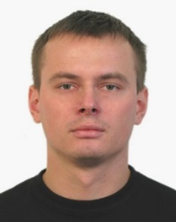

# My experience background

2018 — now <br>
_5 years._

### LifeTech in the position of Engineer-Programmer of the Software Development Department

<details>
    <summary>
LifeTech in the position of Engineer-Programmer of the Software Development Department
</summary>

    * Support and exploitation Backbone Network Inventory Framework (from NetCracker).
    <p>Development/Update/Turning/Logical optimization network reports based on complex SQL queries with using analytical functions and hierarchy queries.</p>
    <p>Development of JAVA classes and methods to implement customer’s business logic.</p>
    <p>Development of new REST/SOAP web-services by using JS-like scripting language.</p>
    <p>Support Network Inventory ETL dataflow processes.</p>

</details>

* Support and exploitation Backbone Network Inventory Framework (from NetCracker).
* Development/Update/Turning/Logical optimization network reports based on complex SQL queries with using analytical
  functions and hierarchy queries.
* Development of JAVA classes and methods to implement customer’s business logic.
* Development of new REST/SOAP web-services by using JS-like scripting language.
* Support Network Inventory ETL dataflow processes.

***

Oct 2016 — 2018 <br>
_2 year._

### A1(velcom) in the position of Engineer-Programmer of the Development Application group

* Development of PL/SQL API for IVR and web-site.
* Development and initialization of new services in the back-end (Java) for shop.velcom.by
* Refactoring and debugging Java code for the website.
* Script design/implementation of IVR for the Aspect M3 Designer application, USSD.
* IVR interconnect tuning with billing system by using SOAP web-services.

- Projects:
    - Participation in Implementation insurance service for smartphones (developing utility classes, creating JDBC
      connections and preparing SQL statements for it, prestaging JSON and SOAP requests)
    - My own Java application: IVR-handler to manage vast system options for automatic answering and self-care (idea +
      design and implementation preparations).

***

Oct 2012 — Oct. 2016 <br>
_4 years 1 mon._

### A1(velcom) in the position of Engineer-Programmer of the Billing Operation group

* API modification as it relates to tax initialization in 2013.
* Preparation and execution of the denomination in the DB level in 2016.
* Tuning of PL SQL procedures/function, tables, bug fixing.
* Analysis of table data in order to make adjustments using sql-join, merge, sql correlated subqueries, sql analytic
  functions.
* Development info/alert triggers.
* API-development for new services.

***

Apr 2009 — Oct 2012 <br>
_3 year 7 mon._

### A1(velcom) in the position of Network Operation Control Engineer

* Automation of routing processes using AutoIT, Excel, WinFIOL machine commands, UNIX shell scripting.

***

Jun 2007 — May 2009 <br>
_1 year 11 mon._

### Republican Unitary Enterprise "Bellesexport" in the position of Sysadmin

* Kerio WinRoute Firewall administration.
* VLAN managing.
* AnyKey troubleshooter.
* Maintain network and devices.

*** 

# My core skills

* Oracle PL/SQL
* Relational databases

- Java:
- Servlets (Apache Tomcat)
- Spring Framework
    - Spring Boot
    - Spring MVC
    - Spring Data
- Lyambda

* REST
* SCV: Tortoise SVN , **GIT**
* Apache Maven
* Linux
* Good knowledge of model OSI / telecom protocols
* JIRA
* Business requirements analysis and design of schematic block diagram
* Touch typing

# About myself

```
Responsive, purposeful, well intentioned and balanced.
I'm interested back-end technologies,
especially in the Telecom domain where I could 
apply my skills and improve my experience.
```

## Education

**Belorussian State Technical University** _2002 – 2007, Minsk_ <br>
Instrument Engineering Department. <br>
Engineer. <br>
Profession: «safety technology», <br>
Specialty: «Hardware-software tools of protection of computer information»

### Foreign language

English — I can read professional documentation and I have good communication skills.

# Trainings

1. [x] 2021 practicum.yandex.ru - Курс «Python-разработчик» , Django, Algorithms, Docker
2. [x] 2020
   it-academy.by - [Промышленная разработка программного обеспечения на Java](https://www.it-academy.by/course/java-developer/)
3. [x] 2019 javaops.ru - Enterprise Java-разработчик
4. [x] 2018 Javarush.ru - Java Core, Multithreading, Collections
5. [x] 2017 SoftLine Education - Java SE Programing. Core.
6. [x] 2015 SoftLine Education - Tuning SQL Oracle 11g
7. [x] 2013 Knowlege Centre - Oracle Database: PL\SQL Fundamentals
8. [x] 2013 Knowlege Centre - Red Hat Linux Essentials
9. [x] 2011 IBA - Pre-intermediate ENGHLISH
10. [x] 2008 «БЕЛСОФТ» LAN: standards, switching, routing, project design basis

***
Contact me by e-mail: <a href="mailto:fast.optimus@gmail.com">Andrey Zinovich</a>.<br>


