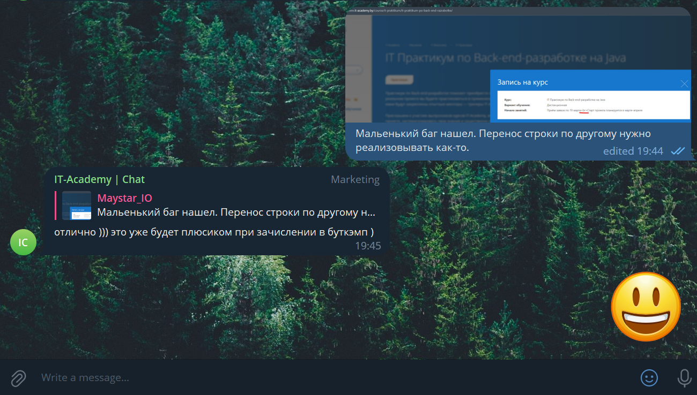

## _Мотивационное письмо_

    
	  1. Почему решили идти в IT и выбрали вашу специальность?  

 
<i> 
В этой сфере работает много инетересных и умных людей, у которых можно много чему научится. 
 
Часто разработки и открытия в этой сфере делают жизнь людей лучше.
 
Специальность Java-разработчика выбрал, т.к. у меня уже есть долгий опыт обучения и разработки на этом языке, при этом мне интересен и нравиться этот язык.
</i>

 

    
	  2. Сколько времени вы готовы уделять участию в проекте? 
  
Что вы будете делать, если времени потребуется больше для достижения результата на проекте? 

 
<i> Готов работать в свободное время, тратя выходные/праздничные дни и вечерние часы после работы. 
  
Если потребуется больше времени, тогда его можно будет взять из отпуска. 
</i>

 

    
	  3. Что вас мотивирует учиться и дальше прокачивать скиллы в IT? 

 
<i>Постижение и последующее умелое практическое применение технологии и результаты её работы очень меня радуют.
 
Преодоление сложных задач и применение современных техник приносят огромное удовольствие.</i>

 

    
	 4. Какие у вас цели на ближайший год и план достижений цели? 

 
 <i>
Найти работу, на которой я бы еще больше смог принести пользы и больше раскрыть свой потенциал. 
 
План действий: вспомнить пройденное и освежить имеющиеся знания, затем пробовать себя на собеседованиях, с последующей корректировкой и устранением выявленных пробелов.  
</i>

 

    
 5. Что будете делать, если после IT Bootcamp вы не сможете найти работу в течение 6 месяцев?  

 
 <i>
Продолжу работать в своей текущей компании не оставляя попыток перейти на более высокий уровень.
</i>

[//]: # ()

 
